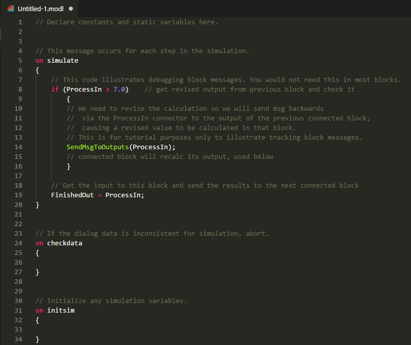

# ModL for Visual Studio Code

This preview release of the extension adds language support for ModL to Visual Studio Code.

## Features

This extension adds rich language support for the ModL language to VS Code, including:

* Syntax highlighting
* Snippets
* Icons

